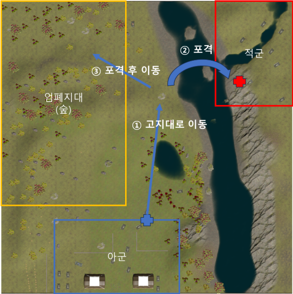

# TBSA-System
TBSA (Tank Battlefield Situational Awareness System) Project

## 프로젝트 개요

> *[여기에 프로젝트 개요를 작성하세요]*

## 작전 시나리오

> *목표: 적군의 동향을 파악하고, 적의 시선을 다른 쪽으로 분산시켜 궤단 이단 조치 중에 있는 아군 전차를 엄호한다.*
1. 아군의 스마트 전차 '로텍스 (Rotex)'를 RP1으로 이동
2. 적군의 전장 상황을 파악하고, 위험도가 높은 적 전차를 판별하여 공격 또는 방어 모드를 실행
3. 아군 기지 후위 합류를 위해 RP2로 이동
4. 베이스캠프로 합류를 위해 적에게 보이지 않도록 우회하여 이동

---

## 시스템 아키텍처

```
┌─────────────────────────────────────────────────────────────────────────┐
│                         Flask Server (app.py)                           │
├─────────────────────────────────────────────────────────────────────────┤
│  SEQ 1          │  SEQ 2          │  SEQ 3          │  SEQ 4            │
│  A* + PID       │  YOLO + LiDAR   │  A* + PID       │  A* + PPO         │
│  정적 경로 주행  │  전투 시스템     │  정적 경로 주행  │  동적 자율주행     │
└─────────────────────────────────────────────────────────────────────────┘
         │                  │                  │                  │
    ┌────▼────┐       ┌─────▼─────┐      ┌────▼────┐       ┌──────▼──────┐
    │ A* Path │       │ Dual YOLO │      │ A* Path │       │ PPO + A*    │
    │ Planner │       │ + Sensor  │      │ Planner │       │ Hybrid      │
    │         │       │ Fusion    │      │         │       │ Planner     │
    └────┬────┘       └─────┬─────┘      └────┬────┘       └──────┬──────┘
         │                  │                  │                  │
    ┌────▼────┐       ┌─────▼─────┐      ┌────▼────┐       ┌──────▼──────┐
    │   PID   │       │  Combat   │      │   PID   │       │     DWA     │
    │ Control │       │  System   │      │ Control │       │   Fallback  │
    └─────────┘       └───────────┘      └─────────┘       └─────────────┘
```

---

## 주요 기능

### 1. 경로 계획 (Path Planning)

#### A* 알고리즘 기반 전역 경로 계획
- **그리드 기반 탐색**: 300×300 월드를 1m 셀 단위로 분할하여 최적 경로 탐색
- **장애물 마진 적용**: SEQ별 상이한 `obstacle_margin` 설정 (SEQ1: 3.0m, SEQ3: 2.3m, SEQ4: 1.5m)
- **Proximity Cost**: 장애물 근접 시 비용 증가로 안전한 경로 선호
- **안전성 가중치 (Safety Weight)**: 장애물 회피 강도 조절 가능 (SEQ별 차등 적용)
- **No-Go Zone 마스킹**: 특정 영역을 통과 불가 구역으로 설정 가능

#### Dynamic Window Approach (DWA) 로컬 플래너
- **실시간 장애물 회피**: 예측 시간(2초) 동안의 궤적 시뮬레이션
- **비용 함수 기반 최적화**: 목표 지향 + 속도 + 장애물 회피 비용의 가중 합
- **Costmap 연동**: LiDAR 기반 Costmap과 통합하여 동적 환경 대응
- **Stuck 복구 모드**: 후진 + 회전으로 막힌 상황 탈출

### 2. 제어 시스템 (Control System)

#### PID 제어기 (SEQ 1, 3)
- **경로 추종**: A* 경로 상의 Lookahead 포인트를 향해 조향
- **속도-조향 연동**: 조향 각도가 클수록 속도 자동 감속
- **오차 누적 방지**: 적분 항 제한 및 주기적 리셋

#### 하이브리드 제어기
- **SEQ 1, 3**: A* 전역 경로 + PID 추종
- **SEQ 4**: A* + PPO 강화학습 혼합 제어
  - 가중 평균 방식: `A*_weight × A*_cmd + PPO_weight × PPO_cmd`
  - 기본 설정: A* 75%, PPO 25%
  - PPO 실패 시 A* 100%로 자동 전환

### 3. PPO 강화학습 (Reinforcement Learning)

#### 통합 PPO 플래너 (`UnifiedPPOPlanner`)
- **다중 모델 지원**: ZIP 파일 및 디렉토리 형식 모델 자동 탐지
- **우선순위 로딩**: `ppo.zip` → `withobs_model` → 기타 학습 모델
- **Warm-up 최적화**: 첫 추론 지연 제거를 위한 GPU 초기화

#### 관측 공간 (Observation Space)
- **86차원 구조** (core.zip 호환):
  - Speed (1): 현재 속도
  - Goal Features (20): 4개 Lookahead 포인트 × 5개 특성
  - LiDAR (65): 360도 스캔, 전방 ±90도 집중 필터링
- **35차원 구조** (간소화 버전):
  - LiDAR (32) + Goal (2) + Velocity (1)

#### 행동 공간 (Action Space)
- **연속 제어**: `[steering, speed]` (각 -1.0 ~ 1.0)
- **명령 변환**: 연속값 → 이산 명령(W/S/A/D) + 가중치

### 4. LiDAR 처리 시스템

#### 파일 모니터링 (`LidarLogger`)
- **실시간 폴링**: JSON 파일 변경 감지 및 자동 처리
- **Windows 파일 잠금 대응**: 재시도 로직 및 자동 정리

#### Costmap 생성
- **지형 분석**: 경사도, 거칠기, 지면 비율 기반 통행 비용 계산
- **장애물 팽창 (Inflation)**: 안전 마진을 위한 장애물 영역 확장
- **전역 장애물 누적**: 탐지된 장애물을 메모리에 FIFO 방식 저장 (최대 300개)

#### 센서 퓨전
- **3D → 2D 투영**: LiDAR 포인트를 카메라 이미지 좌표로 변환
- **FOV 기반 내적 행렬**: 수평 47.81°, 수직 28° FOV 적용
- **BBox-LiDAR 매칭**: 객체 탐지 결과와 LiDAR 거리 정보 결합

### 5. 전투 시스템 (Combat System)

#### 전투 시스템 상태


- **SCAN**: 터렛 회전하며 적 탐색 (포신 하향 → 회전 탐색)
- **STANDBY**: 타겟 잠금 및 조준 정렬 대기
- **RESCAN**: 터렛을 다시 회전하며 적 탐색 (SCAN 상태로 돌아감)
- **FIRE**: 조준 완료 시 발사 실행
- **RETREAT**: 사전 지정된 RP2로 이동할 수 있도록 포신 정렬

#### 듀얼 YOLO 객체 인식
- **Cannon 전용 모델**: 적 포탑 탐지 특화
- **통합 객체 인식 모델**: Mine, Red, Rock, Tank, Tree 분류
- **NMS 중복 제거**: IoU 기반 Overlap 박스 필터링
- **ByteTrack 추적**: 탐지된 Tank에 고유 ID 부여

#### 조준 시스템
- **Yaw/Pitch 오차 계산**: 타겟 BBox 중심과 화면 중심 간 각도 차이
- **스무싱**: EMA 필터로 조준점 떨림 방지
- **Lead Aiming**: 거리에 따른 Pitch 오프셋 자동 보정
- **Auto Attack**: 지정 좌표 자동 조준 및 발사

#### LiDAR 타겟 잠금
- **각도/거리 기반 추적**: 잠금된 타겟의 상대 위치 지속 추적
- **잠금 유지 조건**: 각도 허용 오차 3°, 거리 허용 오차 2m
- **자동 잠금 해제**: 10초 타임아웃 또는 타겟 손실 시

### 6. 시각화 및 모니터링

#### 실시간 시각화
- **Costmap 뷰**: LiDAR 기반 비용 맵 히트맵
- **경로 뷰**: A* 전역 경로 + DWA 로컬 궤적
- **자율주행 통합 뷰**: 장애물 + 경로 + 현재 위치 오버레이

#### 웹 모니터링 UI
- **SEQ 자동 전환**: 현재 시퀀스에 맞는 UI 자동 표시
- **실시간 상태 폴링**: 1초 간격 상태 업데이트
- **전투 모드 버튼**: FIRE, RESCAN 등 사용자 입력 처리

---

## API 엔드포인트

### 주행 관련

| 엔드포인트 | 메서드 | 설명 |
|------------|--------|------|
| `/get_action` | POST | 현재 위치 기반 주행 명령 반환 |
| `/set_destination` | POST | 목적지 좌표 설정 |
| `/update_obstacle` | POST | 장애물 정보 업데이트 |
| `/status` | GET | 시스템 상태 조회 |

### 전투 관련

| 엔드포인트 | 메서드 | 설명 |
|------------|--------|------|
| `/detect` | POST | 이미지 내 객체 탐지 |
| `/combat_action` | POST | 전투 액션 실행 (FIRE, RESCAN 등) |
| `/set_scan_direction` | POST | 스캔 방향 설정 (Q/E) |

### 시각화

| 엔드포인트 | 메서드 | 설명 |
|------------|--------|------|
| `/view_costmap` | GET | Costmap 이미지 |
| `/view_path` | GET | 경로 이미지 |
| `/view_seq4_detailed` | GET | SEQ4 상세 시각화 |
| `/monitor` | GET | 웹 모니터링 UI |

---

## 설정 (Configuration)

### 주요 설정 파라미터

```python
# A* 경로 계획
CELL_SIZE = 1.0           # 그리드 셀 크기 (m)
OBSTACLE_MARGIN = 3.3     # 장애물 마진 (m)
SAFETY_WEIGHT = 1.5       # 안전성 가중치

# PID 제어
KP = 0.02                 # 비례 계수
KI = 0.0001               # 적분 계수
KD = 0.01                 # 미분 계수

# DWA
MAX_SPEED = 0.15          # 최대 속도
PREDICT_TIME = 2.0        # 예측 시간 (초)
OBSTACLE_COST_GAIN = 6.0  # 장애물 회피 비용 가중치

# 전투 시스템
AIM_YAW_THRESH_DEG = 3.0  # 조준 Yaw 임계값 (°)
FIRE_PITCH_THRESH_DEG = 6.0  # 발사 Pitch 임계값 (°)
```

---

## 설치 및 실행

### 요구사항

- Python 3.10+
- CUDA (GPU 가속 사용 시)

### 설치

```bash
pip install -r requirements.txt
```

### 실행

```bash
python app.py
```

서버가 `http://0.0.0.0:5000`에서 시작됩니다.

---

## 프로젝트 구조

```
project/
├── app.py                      # Flask 서버 메인
├── config.py                   # 전역 설정 관리
├── requirements.txt            # 의존성 목록
│
├── controllers/
│   ├── hybrid_controller.py    # SEQ별 분리 제어 (A*+PID, DWA, PPO)
│   └── pid_controller.py       # PID 제어기
│
├── planners/
│   ├── astar_planner.py        # A* 전역 경로 계획
│   ├── dwa_planner.py          # DWA 로컬 플래너
│   └── gyuppo_planner.py       # 통합 PPO 플래너
│
├── utils/
│   ├── state_manager.py        # 전역 상태 관리
│   ├── lidar_logger.py         # LiDAR 파일 모니터링 + Costmap
│   ├── combat_system.py        # 전투 로직 (조준, 발사)
│   └── visualization.py        # 시각화 매니저
│
├── models/
│   ├── best.pt                 # YOLO 모델 (Legacy)
│   ├── cannon.pt               # Cannon 전용 YOLO
│   ├── integrated.pt           # 통합 객체 인식 YOLO
│   ├── ppo.zip                 # PPO 강화학습 모델
│   └── lidar_frame.py          # LiDAR 데이터 처리
│
├── gyuppo_models/              # 추가 PPO 모델들
│   └── cnn/
│       └── withobs_model/      # 장애물 인식 PPO
│
├── static/                     # 정적 파일 (CSS, JS)
└── templates/
    └── monitor.html            # 웹 모니터링 UI
```

---

## 만든이들

| 이름 | 담당 | Contact |
|------|------|------|
|  |  |  |
|  |  |  |
|  |  |  |
|  |  |  |

---

## 출처

| 항목 | 출처 |
|------|------|
| 전차 시뮬레이터 | @BANGBAEDONG VALLEY |
| 첨부 이미지 | @GOOGLE GEMINI |